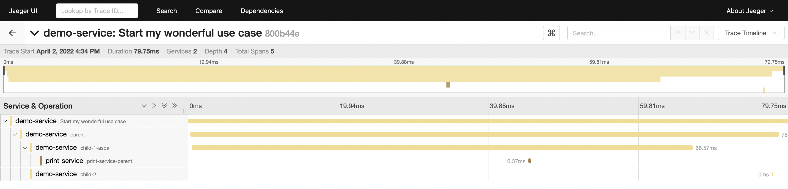
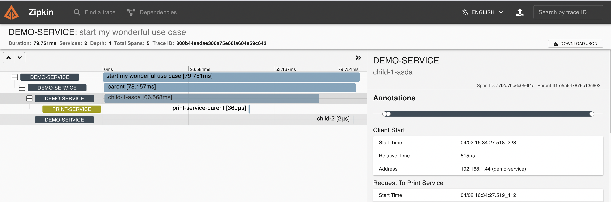
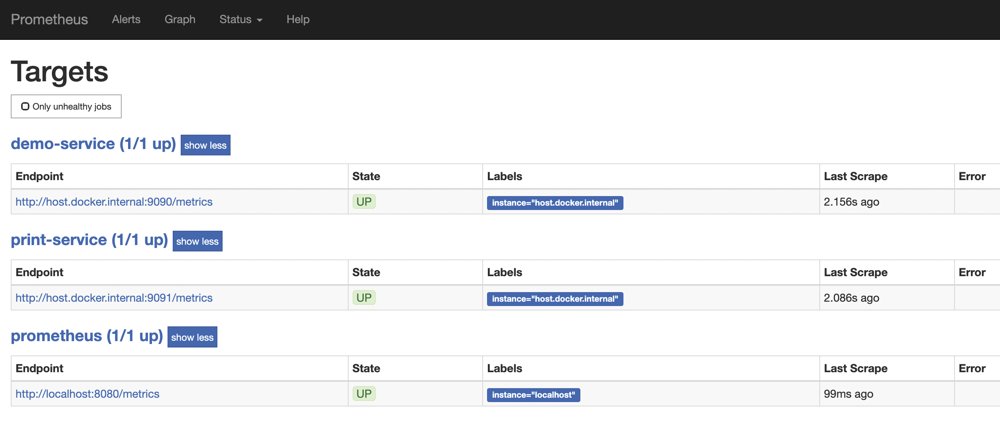
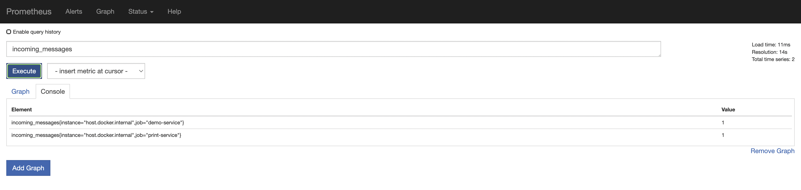
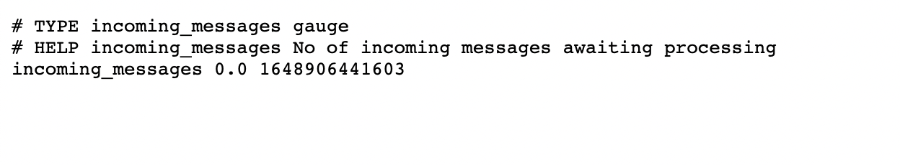

# Telemetry Data - Manual Instrumentation in Spring Boot with OpenTelemetry

## Demo-Service
* curl --location --request GET 'http://localhost:8080/api/'
* Prometheus Exporter: http://localhost:9090/metrics


## Print-Service
* curl --location --request POST 'http://localhost:8081/print'
* Prometheus Exporter: http://localhost:9091/metrics

## Jaeger
```
http://localhost:16686/
```


## Zipkin
```
http://localhost:9411/zipkin/
```


## Prometheus
```
http://localhost:9092/targets
```




## Resources
* Manual Instrumentation - https://opentelemetry.io/docs/instrumentation/java/manual/
* Java Examples - https://github.com/open-telemetry/opentelemetry-java-docs#java-opentelemetry-examples